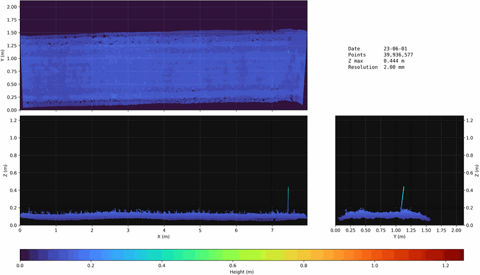
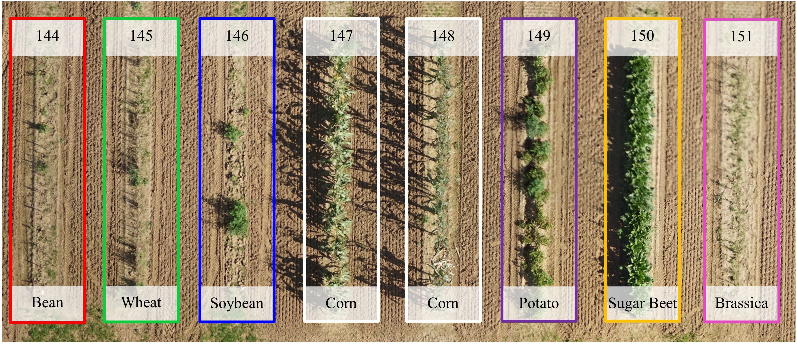
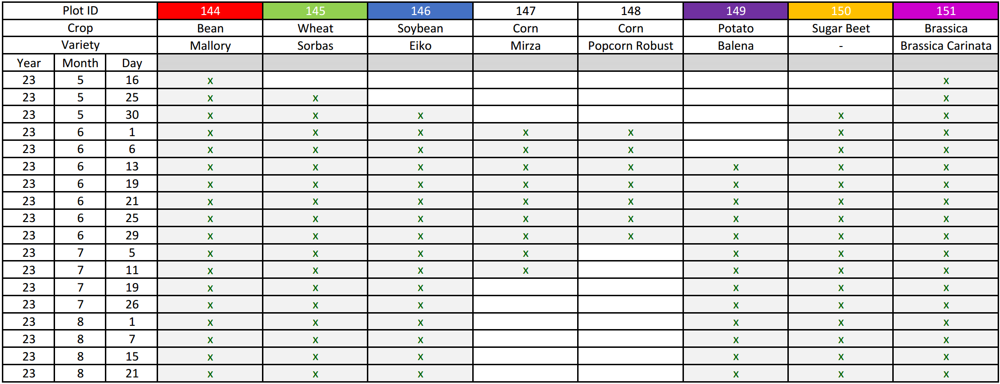

# FieldPheno4D Dataset

> **Note:** The included web-based interactive viewer is currently **under construction**.

## Overview
**FieldPheno4D** is a dataset containing high-quality and multitemporal 3D point clouds of multiple crops captured in the field using a robotic field robot. 

The dataset was gathered using a custom **Field Robot for High-throughput and High-resolution 3D Plant Phenotyping**. This robotic platform is equipped with two industrial-grade laser triangulation scanners and a highly-accurate georeferencing system to enable multi-temporal 3D reconstruction in agricultural fields, supporting the estimation of phenotypic traits such as leaf area, leaf angle, and plant height. You can find more detailed information about the robotic platform in our paper: [DOI](https://doi.org/10.1109/MRA.2023.3321402). The dataset was created in 2023 on the PhenoRob experimental field at Campus Klein-Altendorf, near Bonn, Germany.

## Dataset Teaser Visualization
Below is an **animated .gif demo** showing the multitemporal changes of the single crop plot 147 from the dataset including multiple corn plants. Each point cloud is georeferenced with centimeter accuracy and ICP fine-registered over time to ensure a temporal alignment. More crop plots will be added in the future.



## Dataset Content

<figure style="width: 100% !important; margin: 0 !important; padding: 0 !important; clear: both !important;">
  
</figure>

The crop plots are measured by the field robot platform as described above from May to September during the vegetation period 2023 at an experimental field close to Bonn, Germany. The following timetable summarizes the days of measurements for each crop plot.

<figure style="width: 100% !important; margin: 0 !important; padding: 0 !important; clear: both !important;">
  
</figure>


## Download data

> **Note:** All point clouds and additional metadata will be made available on [Bonndata](https://bonndata.uni-bonn.de/).

## Local Website Viewer

The repository also includes a web application to interactively browse different crop plots (PXXX) and view nadir and side views of the 3D point clouds across a temporal slider.

### Project Structure
- `website/app.py`: Flask backend serving the metadata and static views.
- `website/templates/`: HTML templates for the frontend.
- `website/static/`: CSS and JavaScript files for interactivity and styling.
- `./data/FieldPheno4D/`: Target directory for the dataset (expected format: `./data/FieldPheno4D/<plot_id>/<date>/image.png`).

## Installation

Run the provided installation script to create a virtual environment and install the required dependencies:

```bash
./installation.sh
```

This also installs the local `pointcloudlib` clone from `lib/pointcloudlib` so the DEM preview script can import it directly.

## DEM Preview Script

The repository includes `scripts/generate_fieldpheno4d_dem.py`, which wraps `pointcloudlib.dem.process_plot_dem` and reads its defaults from `scripts/process_plot_dem_config.json`.

Example:

```bash
source venv/bin/activate
python3 scripts/generate_fieldpheno4d_dem.py data/FieldPheno4D --output-root data/FieldPheno4Dimg
```

The DEM pipeline writes previews into the dataset plot folder, for example `.../P144/reg_all/dem/png/...`, and mirrors them into `FieldPheno4Dimg` when requested. GeoTIFF generation is disabled by default to keep the run focused on PNG previews.

If you want to add the computed height scalar back into the source LAS files during processing, enable `write_pointclouds` in `scripts/process_plot_dem_config.json`.

## Running the Application

1. Activate the environment:
```bash
source venv/bin/activate
```
2. Start the flask application:
```bash
python3 scripts/run_website.py
```

To build a GIF from one plot folder, use:

```bash
python3 scripts/make_gif.py P147 --images-root data/FieldPheno4Dimg
```
3. Open `http://localhost:5000` in your browser.

## Publishing on GitHub Pages

The website has a single static export path for GitHub Pages.

1. Generate a GitHub-Pages-ready site bundle locally if you want to test it first:
```bash
./venv/bin/python3 scripts/build_github_pages.py
```
2. Push the repository to your public GitHub account.
3. In the repository settings, set GitHub Pages to deploy with GitHub Actions.

The build script prepares `site/` only. The workflow at `.github/workflows/pages.yml` publishes `site/` automatically on every push to `main`.


## Acknowledgments

This work has been funded by the Deutsche Forschungsgemeinschaft (DFG, German Research Foundation) under Germany’s Excellence Strategy, EXC-2070 – 390732324 – PhenoRob.